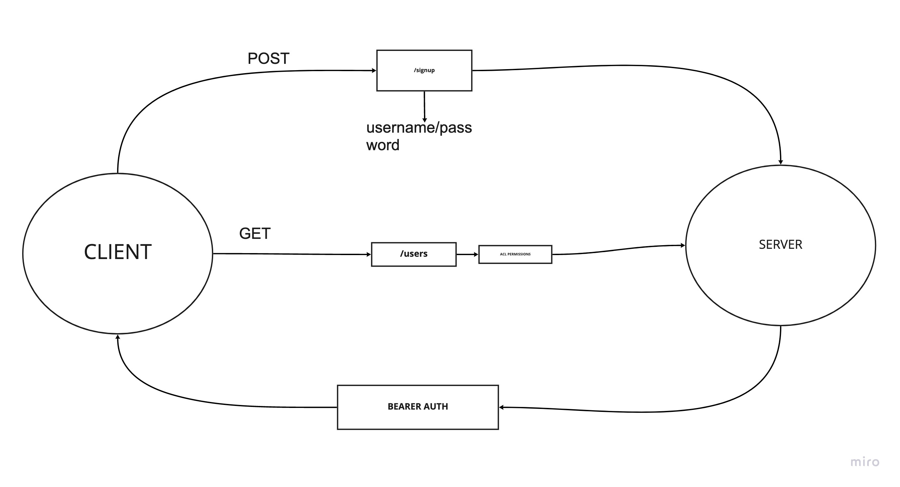

# Auth API

***

## Created by Cameron Walden

***

## Problem Domain

**Phase 3:**

Extend the restrictive capabilities of our routes to our API, implementing a fully functional, authenticated and authorized API Server using the latest coding techniques:

- Regular users can READ

- Writers can READ and CREATE

- Editors can READ, CREATE, and UPDATE

- Administrators can READ, CREATE, UPDATE, and DELETE

***

## UML

